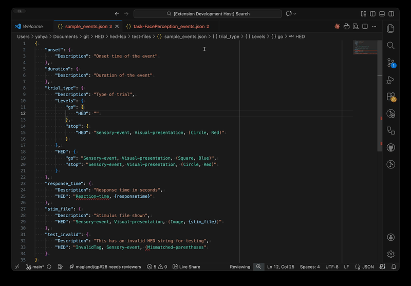
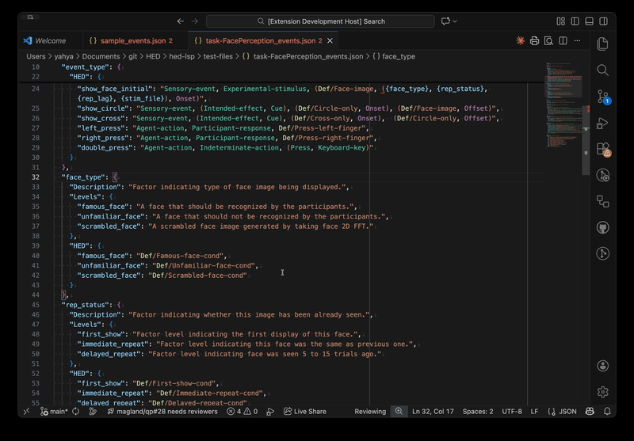
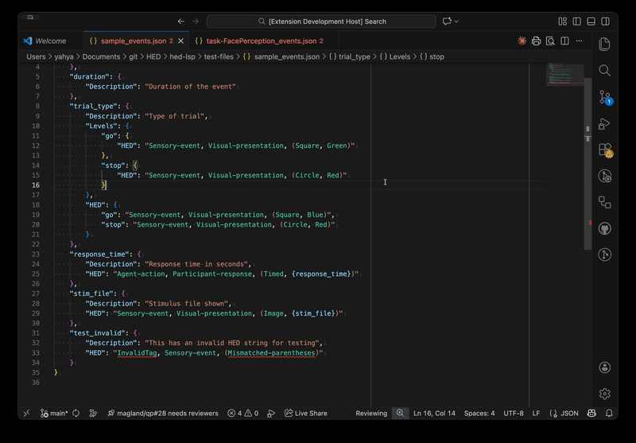
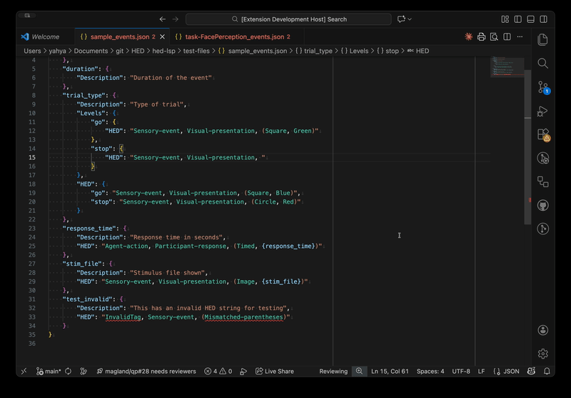

# HED Language Support

[](https://github.com/hed-standard/hed-lsp/actions/workflows/ci.yml)
[](https://opensource.org/licenses/MIT)
[](https://marketplace.visualstudio.com/items?itemName=neuromechanist.hed-lsp-client)

Language Server Protocol implementation for [HED (Hierarchical Event Descriptors)](https://www.hedtags.org/), providing intelligent editing support for annotating neuroimaging data in BIDS datasets.

## Features

### Real-time Validation

Validates HED strings against the official HED schema with inline error and warning markers.


### Schema-aware Autocomplete

Context-aware tag suggestions from the HED hierarchy with semantic search.



### Definition Tracking

Navigate from `Def/Name` references to their `Definition/Name` declarations with Go to Definition (F12).



### Hover Documentation

View tag descriptions, full paths, and related tags on hover.



### Semantic Search & Warnings

Type natural language terms to find relevant HED tags. Warnings help catch semantic issues like using a more specific tag than needed.



## Supported File Types

- **JSON sidecars** (`*_events.json`, `dataset_description.json`)
- **TSV files** (`*_events.tsv`)

## Installation

### From VS Code Marketplace

1. Open VS Code
2. Go to Extensions (Ctrl+Shift+X / Cmd+Shift+X)
3. Search for "HED Language Support"
4. Click Install

### From VSIX

Download the `.vsix` file from [GitHub Releases](https://github.com/hed-standard/hed-lsp/releases) and install:

```bash
code --install-extension hed-lsp-0.3.0.vsix
```

## Configuration

Configure the HED schema version in your VS Code settings:

```json
{
  "hed.schemaVersion": "8.3.0"
}
```

The extension automatically detects schema versions from `dataset_description.json` when present.

### Supported Schemas

- **Standard Schema**: HED 8.x (default: 8.3.0)
- **Library Schemas**: SCORE, LANG, and other HED libraries

## Usage

### Autocomplete

- Type `/` after a tag to see child tags
- Type `,` or `(` to see top-level tags
- Type natural language terms (e.g., "button press") for semantic suggestions
- After `Def/`, see definitions from the current document

### Validation

- Errors appear as red squiggles with diagnostic messages
- Warnings appear as yellow squiggles
- `{column}` placeholders are automatically skipped during validation

### Navigation

- **Hover**: View tag documentation
- **Go to Definition** (F12): Jump from `Def/Name` to `Definition/Name`

## Development

```bash
# Clone the repository
git clone https://github.com/hed-standard/hed-lsp.git
cd hed-lsp

# Install dependencies
npm install

# Compile
npm run compile

# Run tests
cd server && npm test

# Package extension
npx @vscode/vsce package
```

## Project Structure

```
hed-lsp/
├── client/              # VS Code extension client
│   └── src/
│       └── extension.ts
├── server/              # LSP server implementation
│   └── src/
│       ├── server.ts        # LSP connection and handlers
│       ├── validation.ts    # HED validation
│       ├── completion.ts    # Autocomplete provider
│       ├── hover.ts         # Hover documentation
│       ├── embeddings.ts    # Semantic search
│       └── definitionProvider.ts
├── docs/                # Architecture documentation
└── .github/             # CI/CD workflows
```

## Contributing

Contributions are welcome! Please see [CONTRIBUTING.md](CONTRIBUTING.md) for guidelines.

### Reporting Issues

Use the [issue templates](https://github.com/hed-standard/hed-lsp/issues/new/choose) for bug reports and feature requests.

## License

MIT License. See [LICENSE](LICENSE) for details.

## Related Projects

- [HED Resources](https://www.hed-resources.org) - HED documentation and tutorials
- [hed-python](https://github.com/hed-standard/hed-python) - Python HED tools (`hedtools` on PyPI)
- [hed-javascript](https://github.com/hed-standard/hed-javascript) - JavaScript HED validator (`hed-validator` on npm)
- [hed-schemas](https://github.com/hed-standard/hed-schemas) - HED schema definitions

## Acknowledgments

Developed by [Seyed Yahya Shirazi](https://github.com/neuromechanist) for the [HED Working Group](https://github.com/hed-standard).
