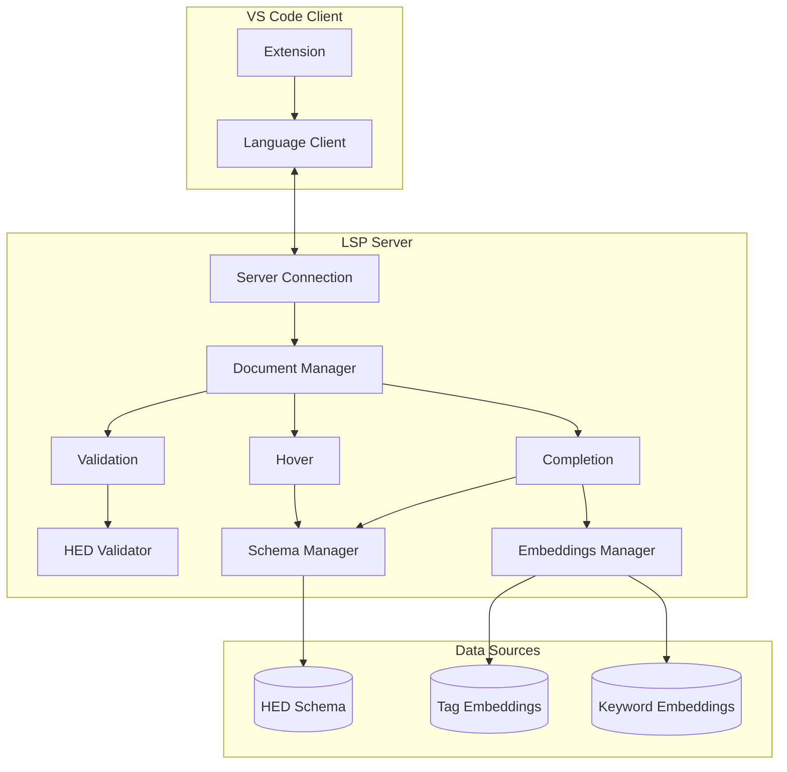

# HED-LSP Documentation

This documentation describes the architecture and implementation of the HED Language Server Protocol (LSP) extension for VS Code.

## What is HED-LSP?

HED-LSP provides intelligent editing support for [HED (Hierarchical Event Descriptors)](https://www.hedtags.org) annotations in JSON sidecar files. It offers:

- **Validation** - Real-time error detection for invalid HED strings
- **Autocomplete** - Schema-aware tag suggestions with semantic search
- **Hover** - Tag descriptions and documentation on hover
- **Diagnostics** - Inline error messages with HED error codes

## Documentation Index

| Document | Description |
|----------|-------------|
| [Architecture](./architecture.md) | Overall system design and component interaction |
| [Completion System](./completion.md) | How autocomplete works, including trigger logic |
| [Semantic Search](./semantic-search.md) | Dual-embedding architecture for intelligent suggestions |
| [Extending](./extending.md) | How to add new keywords and customize behavior |

## Quick Start

```bash
# Install dependencies
npm install

# Build the project
npm run compile

# Run in VS Code
# Press F5 to launch Extension Development Host
```

## Architecture Overview



## Key Components

### Server (`server/src/`)

| File | Purpose |
|------|---------|
| `server.ts` | LSP connection, request routing |
| `completion.ts` | Autocomplete provider |
| `validation.ts` | HED string validation |
| `hover.ts` | Hover information provider |
| `schemaManager.ts` | Schema loading and caching |
| `embeddings.ts` | Semantic search with dual-embedding |
| `documentParser.ts` | JSON parsing for HED strings |

### Client (`client/src/`)

| File | Purpose |
|------|---------|
| `extension.ts` | VS Code extension entry point |

### Data (`server/data/`)

| File | Purpose |
|------|---------|
| `tag-embeddings.compact.json` | Pre-computed embeddings for semantic search |

## Technology Stack

- **Language**: TypeScript
- **LSP**: `vscode-languageserver` / `vscode-languageclient`
- **Validation**: `hed-validator` (npm package)
- **Embeddings**: `@huggingface/transformers` with Qwen3-Embedding-0.6B
