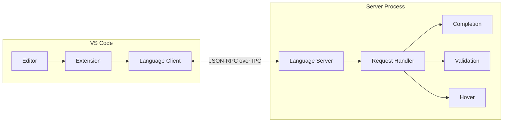
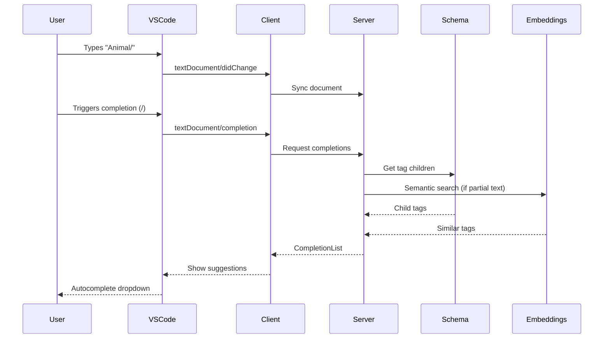
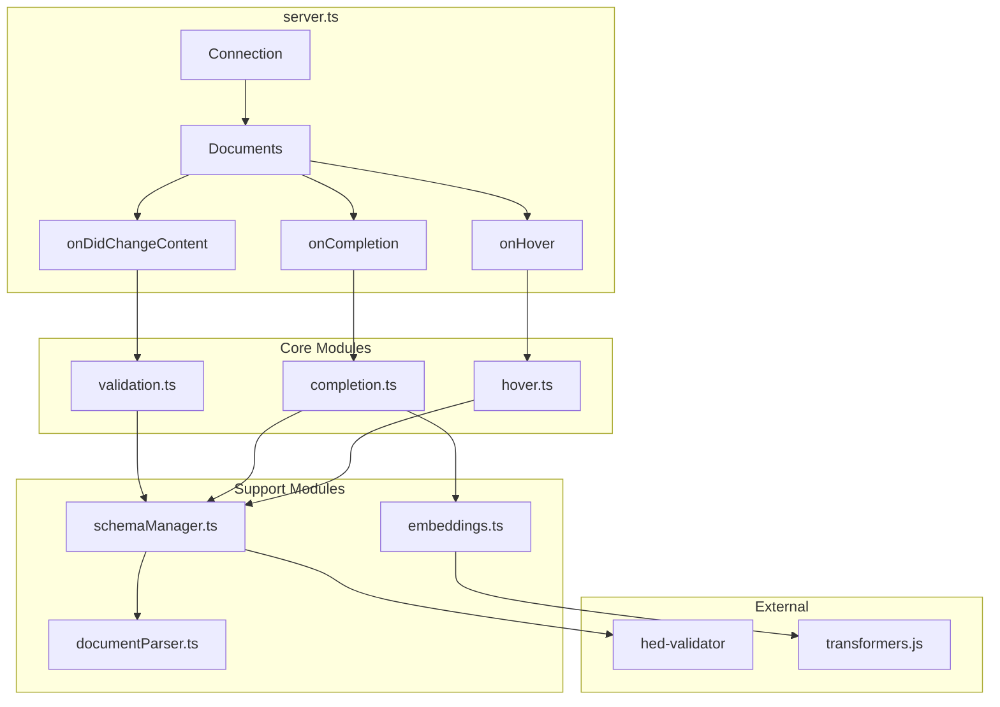
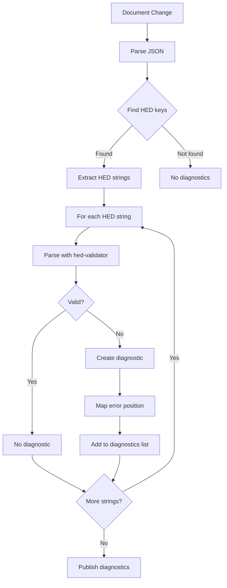
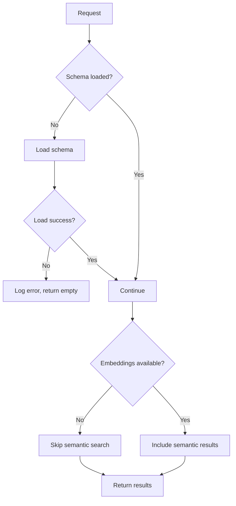

# HED-LSP Architecture

This document describes the overall architecture of the HED-LSP system.

## System Overview

HED-LSP follows the Language Server Protocol (LSP) architecture, separating the VS Code extension (client) from the language intelligence (server).



## Request Flow

When a user types in the editor, requests flow through the system:



## Component Architecture

### Server Components



### Data Flow for Validation



### Data Flow for Completion

```mermaid
flowchart TD
    A[Completion Request] --> B[Get cursor position]
    B --> C[Find HED context]
    C --> D{Trigger character?}

    D -->|/| E[Get parent tag]
    E --> F[Lookup children in schema]

    D -->|, or space| G[Check for partial text]
    G --> H{Has partial?}

    H -->|Yes| I[Prefix match + Semantic search]
    H -->|No| J[Top-level tags]

    D -->|(| K[Start new group]
    K --> J

    F --> L[Build completions]
    I --> L
    J --> L

    L --> M[Sort by relevance]
    M --> N[Return CompletionList]
```

## File Structure

```
hed-lsp/
├── client/                 # VS Code extension
│   ├── src/
│   │   └── extension.ts    # Extension entry point
│   ├── package.json        # Extension manifest
│   └── tsconfig.json
│
├── server/                 # Language server
│   ├── src/
│   │   ├── server.ts       # LSP connection & routing
│   │   ├── completion.ts   # Autocomplete logic
│   │   ├── validation.ts   # HED validation
│   │   ├── hover.ts        # Hover information
│   │   ├── schemaManager.ts # Schema loading
│   │   ├── embeddings.ts   # Semantic search
│   │   ├── documentParser.ts # JSON parsing
│   │   └── types.ts        # Shared types
│   ├── data/
│   │   └── tag-embeddings.compact.json
│   ├── scripts/
│   │   └── generateEmbeddings.ts
│   ├── package.json
│   └── tsconfig.json
│
├── docs/                   # Documentation
├── package.json            # Root workspace
└── tsconfig.json           # Root TypeScript config
```

## Key Design Decisions

### 1. Separate Client/Server

The LSP architecture allows the language intelligence to run in a separate process, improving VS Code responsiveness.

### 2. Schema Caching

Schemas are cached in memory after first load to avoid repeated network/disk access.

### 3. Pre-computed Embeddings

Tag embeddings are pre-computed and stored in JSON to avoid loading the ML model at runtime for most users.

### 4. Dual-Embedding Architecture

Semantic search uses both keyword anchors and direct tag matching to improve relevance. See [Semantic Search](./semantic-search.md) for details.

### 5. Debounced Validation

Validation is debounced (300ms) during typing to reduce CPU usage while still providing responsive feedback.

## Error Handling



The system is designed to degrade gracefully:
- If schema fails to load: validation and completion disabled
- If embeddings fail to load: semantic search disabled, prefix matching still works
- If embedding model fails: falls back to deterministic keyword index
