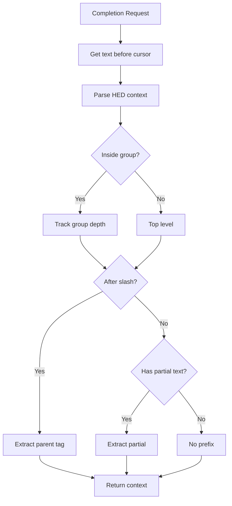
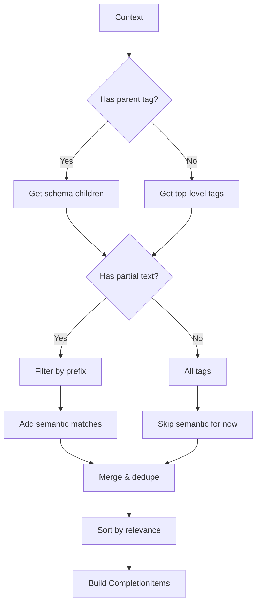
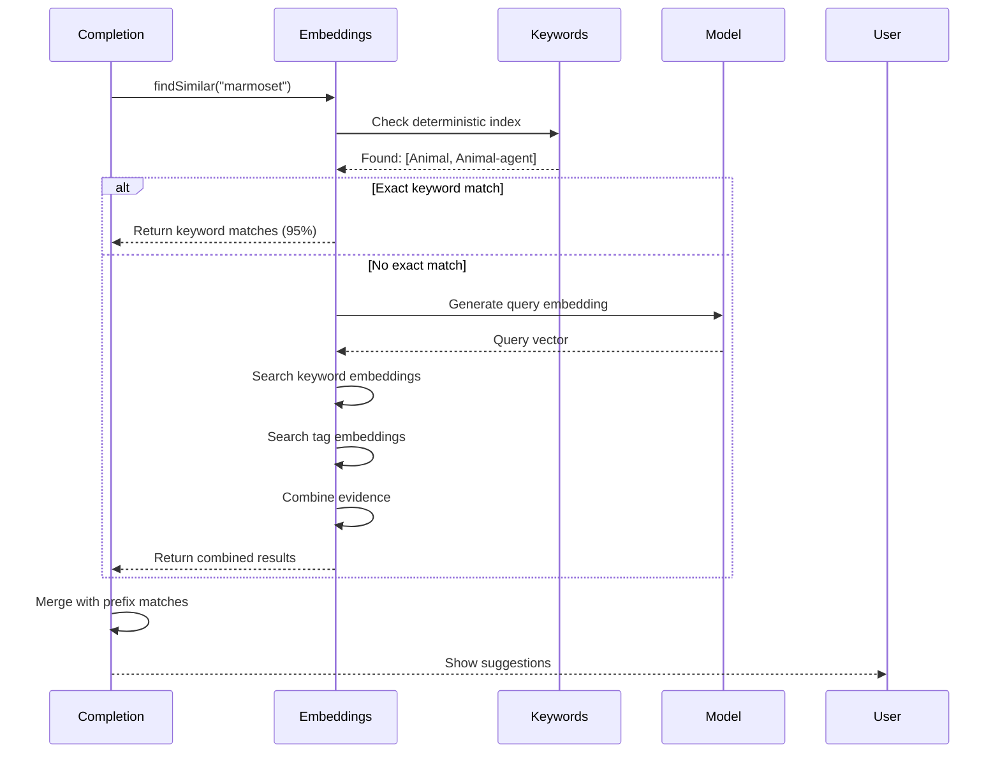

# Completion System

This document describes how the autocomplete/completion system works in HED-LSP.

## Overview

The completion system provides intelligent tag suggestions based on:
1. **Schema structure** - Navigate the HED hierarchy
2. **Prefix matching** - Filter tags by typed text
3. **Semantic search** - Find related tags using embeddings

```mermaid
flowchart TD
    A[User types] --> B{Trigger character?}

    B -->|/| C[Child completion]
    B -->|,| D[New tag completion]
    B -->|space| E[Continue/New tag]
    B -->|(| F[Group completion]
    B -->|letter| G[Filter existing]

    C --> H[Get parent tag children]
    D --> I[Top-level + Semantic]
    E --> I
    F --> I
    G --> J[Prefix match + Semantic]

    H --> K[Build CompletionList]
    I --> K
    J --> K
```

## Trigger Characters

| Character | Behavior | Example |
|-----------|----------|---------|
| `/` | Show children of current tag | `Event/` → Sensory-event, Agent-action |
| `,` | Start new tag at top level | `Event,` → all top-level tags |
| `(` | Start new group | `(` → top-level tags for group |
| ` ` (space) | Continue or new tag | context-dependent |

## Completion Flow

### Step 1: Context Detection

When a completion request arrives, the system determines the context:



### Step 2: Tag Resolution

For `/` triggers, resolve the parent tag:

```typescript
// Example: "Event/Sensory-event/" → parent is "Sensory-event"
const parentTag = getParentTag(textBeforeCursor);
const children = schema.getChildren(parentTag);
```

### Step 3: Suggestion Generation



## Completion Item Structure

Each suggestion is a `CompletionItem` with:

```typescript
{
  label: "Sensory-event",           // Display text
  kind: CompletionItemKind.Value,   // Icon type
  detail: "Event/Sensory-event",    // Long form path
  documentation: "Something that...", // Tag description
  insertText: "Sensory-event",      // Text to insert
  sortText: "0-sensory-event",      // Sort order
  filterText: "sensory-event"       // Match text
}
```

### Sort Order Prefixes

| Prefix | Meaning |
|--------|---------|
| `0-` | Direct match (prefix or exact) |
| `1-` | Extension suggestion |
| `4-` | Semantic match |

## Semantic Search Integration

When the user types partial text, semantic search finds related tags:



## Special Cases

### 1. Value Tags

Tags with `takesValue=true` accept values:

```
Duration/5 s    ← numeric with unit
Label/MyLabel   ← text value
```

### 2. Extension Tags

Tags with `extensionAllowed=true` can be extended:

```
Item/Object/MyCustomObject  ← extending Object
```

### 3. Curly Brace Placeholders

Inside `{column_name}`, no completions are offered:

```
{response_type}, Event  ← no completion inside braces
```

### 4. Definition References

After `Def/`, suggest defined names from the document:

```
Definition/MyDef, ...
Def/MyDef  ← suggests "MyDef"
```

## Performance Considerations

1. **Debouncing**: Completion requests are naturally debounced by VS Code
2. **Caching**: Schema data is cached after first load
3. **Pre-computed embeddings**: No ML model loading for most searches
4. **Early exit**: Return immediately for exact keyword matches

## Configuration

The completion provider is registered with:

```typescript
connection.onCompletion(async (params) => {
  // Handle completion
});

// Trigger characters
capabilities.completionProvider = {
  triggerCharacters: ['/', ',', '(', ' '],
  resolveProvider: true
};
```
