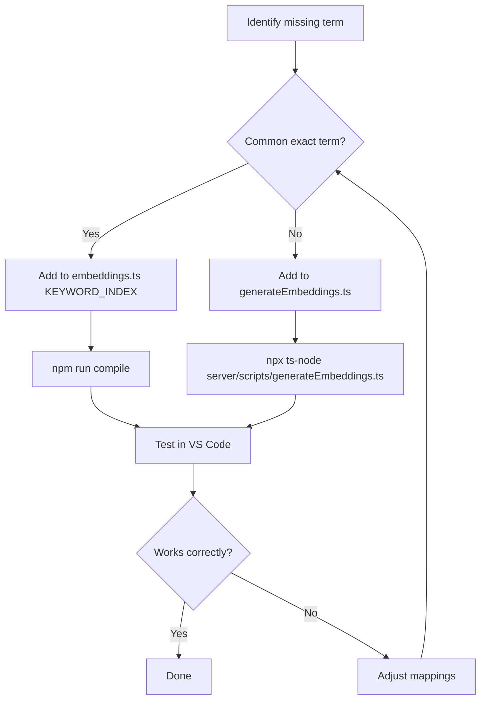

# Extending HED-LSP

This guide explains how to extend the HED-LSP system with new keywords, improve semantic search, and customize behavior.

## Adding New Keywords

Keywords are the primary way to improve semantic search. There are two places to add them:

### 1. Deterministic Index (Instant Lookup)

Edit `server/src/embeddings.ts` and add entries to `KEYWORD_INDEX`:

```typescript
const KEYWORD_INDEX: Record<string, string[]> = {
  // Existing entries...

  // Add your new keywords here:
  'optogenetics': ['Measurement-event', 'Experimental-stimulus'],
  'calcium imaging': ['Measurement-event', 'Data-feature'],
  'patch clamp': ['Measurement-event'],
};
```

**Guidelines:**
- Use lowercase keys
- Map to existing HED tags only
- Multiple tags are allowed (most specific first)
- Rebuild after changes: `npm run compile`

### 2. Embedding Index (Semantic Similarity)

Edit `server/scripts/generateEmbeddings.ts` and add to its `KEYWORD_INDEX`:

```typescript
const KEYWORD_INDEX: Record<string, string[]> = {
  // Add keywords for embedding generation
  'optogenetics': ['Measurement-event', 'Experimental-stimulus'],
  'calcium': ['Measurement-event', 'Data-feature'],
  'voltage': ['Data-feature', 'Measurement-event'],
};
```

Then regenerate embeddings:
```bash
npx ts-node server/scripts/generateEmbeddings.ts
```

## Workflow for Adding Keywords



## Choosing Target Tags

When adding a keyword, consider:

1. **Primary concept**: What HED tag best represents this?
2. **Secondary concepts**: What related tags are relevant?
3. **Agent vs. Item**: Is it an agent performing actions or an item?

### Example Analysis

**Keyword: "optogenetics"**
- Primary: `Measurement-event` (it's a technique for measuring)
- Secondary: `Experimental-stimulus` (light is the stimulus)
- Not: `See` (it's not visual perception)

```typescript
'optogenetics': ['Measurement-event', 'Experimental-stimulus'],
```

**Keyword: "patient"**
- Primary: `Human-agent` (a human performing actions)
- Secondary: `Experiment-participant` (role in experiment)
- Consider: Clinical context

```typescript
'patient': ['Human-agent', 'Experiment-participant'],
```

## Testing New Keywords

Create a test script:

```typescript
// test-keywords.ts
import { embeddingsManager } from './server/src/embeddings';

async function test(query: string) {
  const results = await embeddingsManager.findSimilar(query, 5);
  console.log(`\n"${query}":`);
  for (const r of results) {
    console.log(`  ${r.tag} (${(r.similarity * 100).toFixed(0)}%)`);
  }
}

async function main() {
  await embeddingsManager.loadEmbeddings();

  // Test your new keywords
  await test('optogenetics');
  await test('patch clamp');
  await test('calcium imaging');
}

main();
```

Run with:
```bash
npx ts-node test-keywords.ts
```

## Adding New Keyword Categories

To add a whole new category of terms:

### Step 1: Research the Domain

Identify common terms used in that field:
- Read papers/datasets
- Check existing BIDS datasets
- Consult domain experts

### Step 2: Map to HED Tags

For each term, find appropriate HED tags:
```bash
# Search the schema
grep -i "your-term" server/data/HEDLatest.json
```

Or use the HED online tools: https://hedtools.org or browse at https://www.hedtags.org

### Step 3: Add to Both Files

```typescript
// In embeddings.ts - for exact matching
// =====================
// SLEEP RESEARCH (new category)
// =====================
'rem': ['Asleep', 'Agent-cognitive-state'],
'nrem': ['Asleep', 'Agent-cognitive-state'],
'slow-wave': ['Asleep', 'Data-feature'],
'spindle': ['Data-feature'],
'k-complex': ['Data-feature'],

// In generateEmbeddings.ts - for embedding generation
// Same entries
```

### Step 4: Regenerate and Test

```bash
npm run compile
npx ts-node server/scripts/generateEmbeddings.ts
# Test in VS Code
```

## Adjusting Search Parameters

In `server/src/embeddings.ts`, you can tune:

```typescript
// Minimum similarity to consider a keyword match
const KEYWORD_THRESHOLD = 0.6;  // Lower = more matches, less precise

// Number of similar keywords to consider
const TOP_KEYWORDS = 10;  // Higher = more votes, slower

// Minimum similarity for direct tag match
const TAG_THRESHOLD = 0.5;  // Lower = more results
```

## Adding a New Schema

To support additional HED schemas or library schemas:

### Step 1: Update Schema Loading

In `server/src/schemaManager.ts`:
```typescript
const SCHEMA_VERSION = '8.4.0,sc:score_2.1.0,la:lang_1.1.0,my:mylib_1.0.0';
```

### Step 2: Regenerate Embeddings

```bash
npx ts-node server/scripts/generateEmbeddings.ts
```

The generator automatically includes all tags from all loaded schemas.

## Debugging Search Issues

### Check if keyword exists

```typescript
import { embeddingsManager } from './server/src/embeddings';

// Check deterministic index
const result = embeddingsManager.findByKeyword('your-term');
console.log(result);  // Empty if not found
```

### Check embedding similarity

```typescript
// Requires model loading
const embedding = await embeddingsManager.embed('your-term');
console.log('Embedding dimensions:', embedding?.length);
```

### Enable debug logging

In `server/src/embeddings.ts`, add logging:
```typescript
async findSimilar(query: string, topK: number = 10) {
  console.log(`[DEBUG] Searching for: ${query}`);
  // ...
  console.log(`[DEBUG] Keyword votes:`, tagVotes);
  console.log(`[DEBUG] Direct matches:`, directMatches.size);
}
```

## Common Issues

### Keyword not matching

1. Check case: keywords must be lowercase
2. Check spelling: exact match required for deterministic index
3. Check if embeddings were regenerated after adding

### Wrong tags suggested

1. Review the tag mappings
2. Consider if multiple meanings exist (e.g., "mouse" = animal or device)
3. Add more specific keywords

### Slow search

1. Check if model is loading (should only happen once)
2. Reduce `TOP_KEYWORDS` if needed
3. Increase thresholds to reduce candidates

## Contributing New Keywords

When contributing keywords to the project:

1. **Document the category**: Add a comment header
2. **Be consistent**: Follow existing format
3. **Test thoroughly**: Verify all mappings work
4. **Update docs**: Add to `.context/semantic-keyword-research.md`

Example PR structure:
```
feat: add sleep research keywords

- Add REM/NREM sleep terms
- Add sleep spindle and K-complex
- Add polysomnography terms
- Update embeddings file
```
