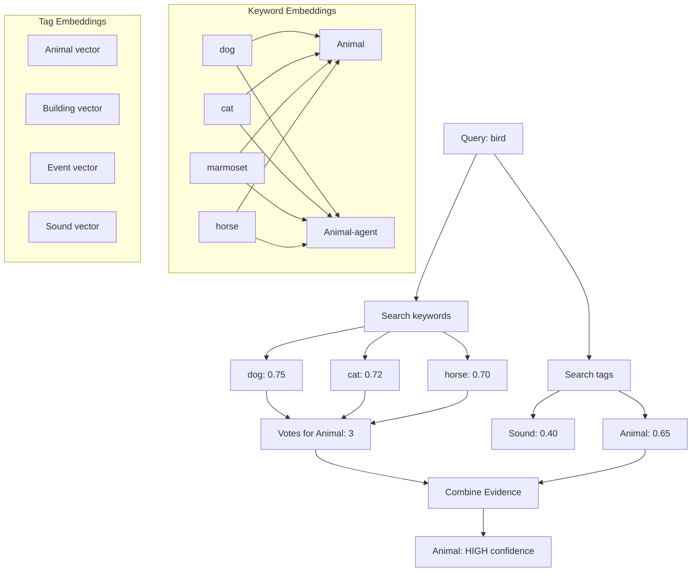
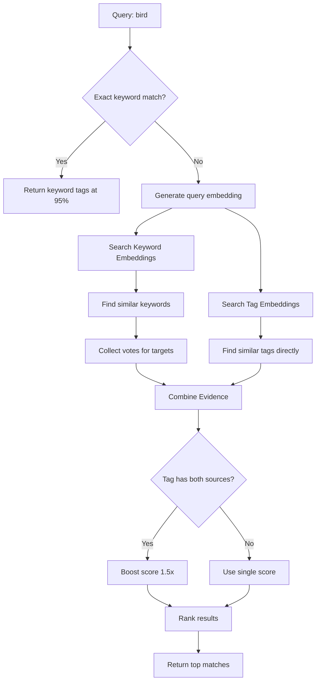
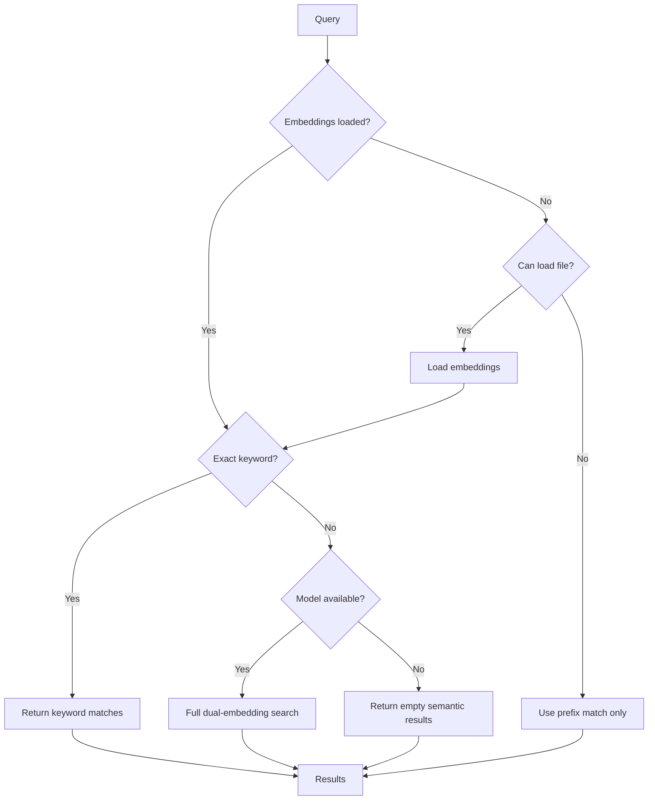

# Semantic Search System

This document describes the dual-embedding architecture used for intelligent tag suggestions.

## The Problem

Users often search for HED tags using terms that don't exactly match tag names:

| User types | Expected tag | Challenge |
|------------|--------------|-----------|
| marmoset | Animal | "marmoset" isn't in schema |
| horse | Animal | Need domain knowledge |
| listening | Hear | Verb form vs. tag name |
| elephant | Animal | Common word, not in schema |

Standard embedding models (like Qwen3) understand general language but lack neuroscience domain knowledge. For example, the embedding for "marmoset" is not naturally close to "Animal" because the model doesn't know marmosets are primates.

## The Solution: Dual-Embedding Architecture

We use two complementary embedding sets:



### Components

1. **Keyword Embeddings** (~180 curated terms)
   - Each keyword points to one or more HED tags
   - Examples: "marmoset" → [Animal, Animal-agent]
   - Acts as "anchors" that vote for tags

2. **Tag Embeddings** (~2000 HED tags)
   - Direct embeddings of tag names
   - Used for similarity matching

3. **Deterministic Index** (fallback)
   - Exact keyword → tag mappings
   - Instant lookup, no embedding needed

## Search Algorithm



### Step-by-Step Example

Query: **"bird"** (not in keyword index)

**Step 1: Generate query embedding**
```
embed("bird") → [0.12, -0.34, 0.56, ...]  # 1024 dimensions
```

**Step 2: Search keyword embeddings**
```
"bird" ↔ "dog":     0.75 → votes for [Animal, Animal-agent]
"bird" ↔ "cat":     0.72 → votes for [Animal, Animal-agent]
"bird" ↔ "horse":   0.70 → votes for [Animal, Animal-agent]
"bird" ↔ "fish":    0.68 → votes for [Animal, Animal-agent]

Keyword votes: {Animal: 4, Animal-agent: 4}
```

**Step 3: Search tag embeddings**
```
"bird" ↔ "Animal":   0.65
"bird" ↔ "Sound":    0.45
"bird" ↔ "See":      0.42

Direct matches: {Animal: 0.65, Sound: 0.45, See: 0.42}
```

**Step 4: Combine evidence**
```
Animal:
  - Keyword evidence: 4 votes, max similarity 0.75
  - Direct evidence: 0.65
  - BOTH sources → 1.5x boost
  - Combined score: 0.94

Sound:
  - Keyword evidence: none
  - Direct evidence: 0.45
  - Single source
  - Combined score: 0.45
```

**Result**: Animal ranks first with high confidence.

## Score Calculation

```typescript
// For tags with keyword votes
const keywordScore = maxSimilarity * (1 + Math.log(votes + 1) * 0.2);
const boostMultiplier = directSimilarity > 0 ? 1.5 : 1.0;
const combinedScore = keywordScore * boostMultiplier + directSimilarity * 0.3;

// For tags with only direct match
const combinedScore = directSimilarity;
```

## Similarity Thresholds

| Threshold | Value | Purpose |
|-----------|-------|---------|
| Keyword similarity | 0.6 | Minimum to consider keyword match |
| Tag similarity | 0.5 | Minimum for direct tag match |
| Top keywords | 10 | Number of similar keywords to use |
| Exact match score | 0.95 | Score for deterministic matches |
| Semantic cap | 0.94 | Maximum semantic match score |

## Embedding Model

- **Model**: Qwen3-Embedding-0.6B (ONNX quantized)
- **Dimensions**: 1024
- **Size**: ~600MB (downloaded on first use)
- **Pooling**: Last token
- **Normalization**: L2 normalized (cosine = dot product)

## Pre-computed Embeddings

Embeddings are pre-generated to avoid runtime model loading:

```
server/data/tag-embeddings.compact.json (~20MB)
├── version: "3.0"
├── modelId: "onnx-community/Qwen3-Embedding-0.6B-ONNX"
├── schemaVersion: "8.4.0,sc:score_2.1.0,la:lang_1.1.0"
├── dimensions: 1024
├── tags: [
│   { tag: "Animal", longForm: "Item/...", vector: [...] },
│   ...
│ ]
└── keywords: [
    { keyword: "marmoset", targets: ["Animal", "Animal-agent"], vector: [...] },
    ...
  ]
```

## Keyword Categories

The keyword index covers neuroscience-relevant terms:

| Category | Examples | Target Tags |
|----------|----------|-------------|
| Lab Animals | marmoset, macaque, mouse, rat | Animal, Animal-agent |
| Human Participants | subject, participant, patient | Human-agent, Experiment-participant |
| Stimuli | stimulus, target, distractor | Experimental-stimulus, Sensory-event |
| Timing | onset, offset, duration | Onset, Offset, Duration |
| Cognitive States | attention, focus, alert | Attentive, Alert |
| Emotions | happy, sad, fearful | Happy, Sad, Fearful |
| Sensory | visual, auditory, touch | See, Hear, Touch |
| Motor | press, click, saccade | Press, Move-eyes |
| Equipment | screen, headphones, keyboard | Computer-screen, Headphones |
| Neuroimaging | EEG, fMRI, spike | Measurement-event, Data-feature |

See [Extending](./extending.md) for how to add new keywords.

## Fallback Behavior

The system degrades gracefully:



## Performance

| Operation | Time | Notes |
|-----------|------|-------|
| Exact keyword lookup | <1ms | Hash table lookup |
| Embedding search | ~50ms | Pre-computed vectors |
| Model inference | ~200ms | Only when needed |
| File loading | ~500ms | Once at startup |

## Future Improvements

1. **More keywords**: Add clinical, pharmacology, VR terms
2. **Learned weights**: Train keyword→tag weights from usage
3. **Contextual search**: Consider surrounding tags
4. **Typo tolerance**: Fuzzy matching for keywords
